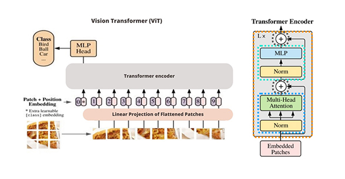

# Vision_transformers_ViT

Training a large model like ViT usually takes a fair amount of data. Using the power of transfer learning to improve our performance it’s a very common practice to evaluate and doing research on models.

GPUs are designed to handle parallel computing tasks, which allows them to perform these matrix multiplication operations much faster than CPUs. GPUs have many more cores than CPUs, allowing them to perform multiple calculations simultaneously, and they have specialized hardware for matrix multiplication, which is a key operation in deep learning.

# Data Loader

Dataloader allows you to load a small batch of the data at a time, typically with randomization and shuffling, so that the entire dataset can be processed in a more memory-efficient way. The original setting of the ViT paper was taken in account except for the batch size set to 32 instead of required 4096.

# Deep Learning

ViT is a deep learning neural network architecture coming from the family of transformers architecture and relative self-attention mechanism. A General  deep learning architecture is usually collection of layers and blocks

# General Overview

